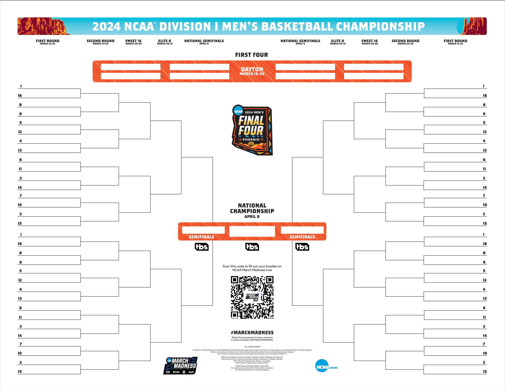

# March Machine Learning Mania 2024
Forecast the 2024 College Basketball Tournaments

# NCAA Basketball Tournament Forecasting Project

* Project Objective:

Forecasting the results of the 2024 collegiate basketball tournament using historical data by presenting a portfolio of brackets for both the men's and women's divisions.

 * What is NCAA?

The National Collegiate Athletic Association(NCAA) is the American organization in charge of overseeing college athletics. It hosts a variety of sporting events, such as the eagerly awaited collegiate basketball competitions for both sexes. Sports lovers and aficionados follow these tournaments closely as they feature elite college teams competing for championship crowns.

* What is March Madness?

"March Madness" refers to the annual NCAA Basketball Tournament, a single-elimination college basketball competition that takes place in the United States. The tournament typically occurs in March and April, involving 68 college basketball teams from the Division I level of the National Collegiate Athletic Association (NCAA). The competition culminates with the crowning of the national champion.

## Requirements

- python 3.9
- `python -m venv .venv`
- `pip install -r requirements.txt`

Report link : https://shubhampalav017.github.io/Basketball_Bracket_Forecasting_2024/

